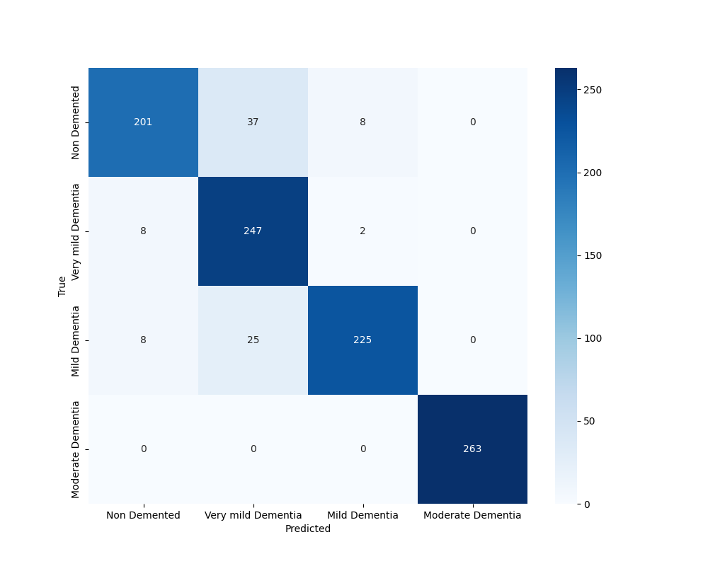

# alzheimers-detection

This library contains the code for our Alzheimer's detection final project.

We provide tools for:

- Training models on the [OASIS dataset](https://www.kaggle.com/datasets/ninadaithal/imagesoasis)
- Evaluating those models and creating visualizations from the results

The evaluation code assumes a `models` directory with state dictionaries of trained models.

Here are some example visualizations:

**Resnet confusion matrix:**

**Vision Transformer ROC Curves**

**Vision Transformer Class Accuracies**

**And some preliminary experimentation with visualizing network activations using `activations.ipynb`:**

